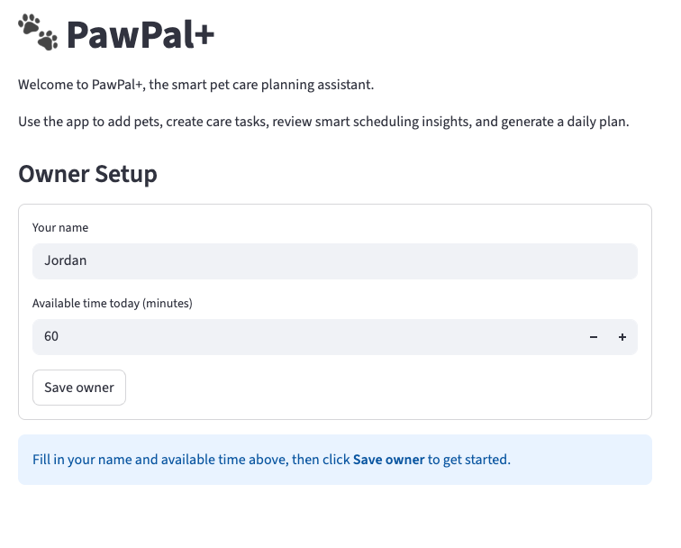
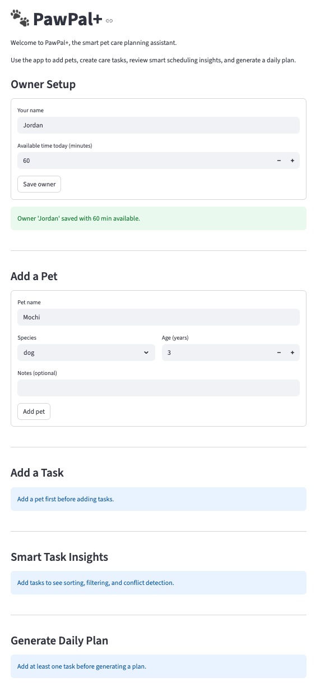
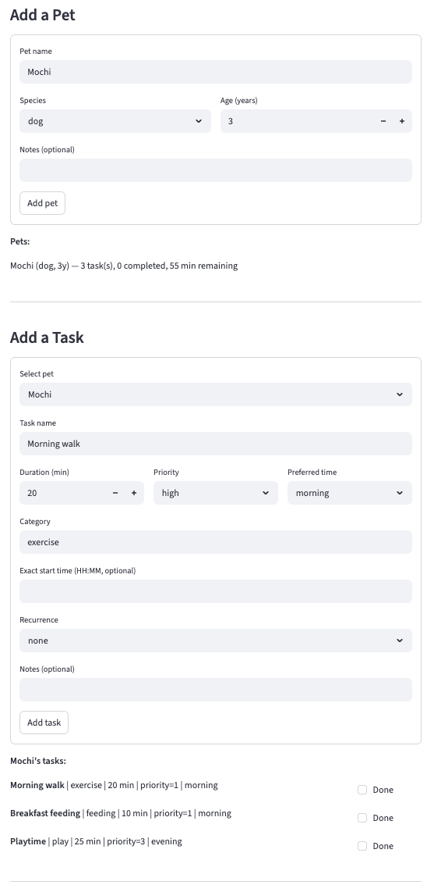
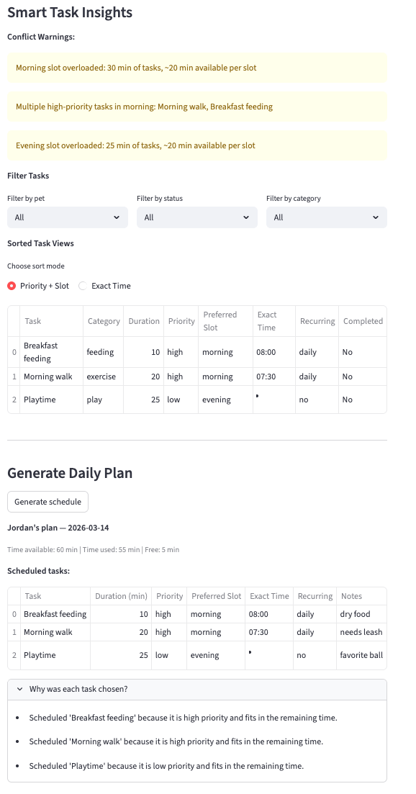
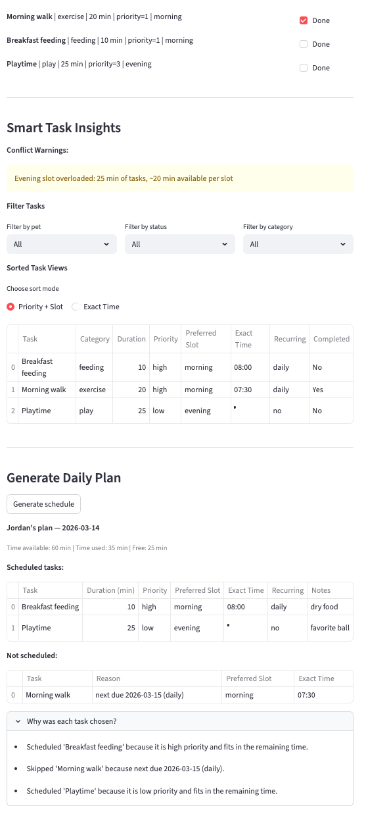

# PawPal+

**PawPal+** is a Streamlit app that helps pet owners plan and track daily care tasks for their pets. It generates a prioritized daily schedule, detects conflicts, supports recurring tasks, and explains every scheduling decision.

---

## Features

### Task Management
- **Multi-pet support** — Create an owner profile and register any number of pets. Each pet maintains its own independent task list, and tasks are tracked by object identity so same-named tasks across different pets are never confused.
- **Rich task model** — Every task captures a name, category, duration, priority level (high / medium / low), preferred time slot (morning / afternoon / evening), an optional exact HH:MM start time, recurrence interval, and freeform notes.
- **Duplicate prevention** — Adding a task with the same name as an existing task on the same pet is rejected by the system. The method returns `False`, allowing the UI to display a warning message.

### Smart Scheduling
- **Greedy daily plan generation** — `generate_daily_plan` sorts tasks by priority and then iteratively schedules each task if it fits within the remaining time budget. Tasks that are invalid, already completed, not yet due, or exceed the remaining time are placed in a "not scheduled" list with an explanation.
- **Priority + slot sorting** — `sort_tasks_by_priority` orders tasks by a three-level key: priority (1 = high → 3 = low), then time slot (morning → afternoon → evening), then shortest duration first. This ensures the most critical morning tasks are always evaluated before lower-priority evening tasks.
- **Chronological sorting** — `sort_by_time` orders tasks by their explicit HH:MM start time using tuple comparison (`"07:30"` → `(7, 30)`). Tasks without an exact time fall back to their slot midpoint (morning = 9:00, afternoon = 13:00, evening = 18:00), so timed and untimed tasks sort sensibly together.
- **Time-budget filtering** — `filter_tasks_that_fit` greedily selects tasks that fit within a given time limit, evaluated in priority order.

### Recurring Tasks
- **Daily and weekly recurrence** — Tasks can be marked as recurring on a `daily` or `weekly` interval. Completing a recurring task records `last_completed_date` automatically and computes `next_due_date` via `timedelta`.
- **Automatic re-entry** — `is_due_today()` gates whether a recurring task re-enters the daily plan. A task completed today will not reappear until its next due date, eliminating the need for manual resets.
- **Overdue detection** — If a recurring task's `next_due_date` is in the past, `is_due_today()` returns `True` immediately, ensuring overdue tasks are never silently dropped from the schedule.

### Conflict Detection
- **Slot overload warning** — If a single time slot (morning, afternoon, or evening) accumulates more task time than one-third of the owner's daily budget, a warning is surfaced so the owner can rebalance their schedule.
- **Multiple high-priority tasks in one slot** — When two or more `priority = 1` tasks share the same preferred time slot, a conflict message names each task so the owner can decide which to reschedule.
- **Exact-time collision detection** — Tasks assigned the same explicit HH:MM start time trigger a warning that identifies each clashing task by name and its owning pet.

### Filtering and Views
- **Filter by status** — `filter_tasks_by_status` returns only pending or only completed tasks from any list, making it easy to see what still needs to be done today.
- **Filter by pet** — `filter_tasks_by_pet` returns only the tasks belonging to a named pet, using object identity rather than name matching to prevent cross-pet confusion.
- **Filter by category** — `filter_tasks_by_category` returns tasks matching a category string (e.g. `"health"`, `"exercise"`) with case-insensitive comparison.
- **Interactive filter panel** — The Smart Task Insights section combines all three filters with a live sort-mode toggle (Priority + Slot or Exact Time), so any combination of pet, status, and category can be explored without regenerating the plan.

### Explainability
- **Per-task scheduling explanations** — Every scheduling decision — whether a task was included or skipped — is recorded as a plain-language string and surfaced in the UI under "Why was each task chosen?".
- **Plan summary** — `get_summary()` reports the number of scheduled and skipped tasks, free time remaining, and an over-capacity percentage when total task demand exceeds the available time budget.
- **Daily plan tracking** — Each generated plan stores the plan date (`plan_date`) so scheduling decisions are tied to a specific day.

---

## 📸 Demo

### Owner Setup — Initial State

The app opens with the Owner Setup form pre-filled with a default name ("Jordan") and 60 minutes of available time. Until the owner is saved, all downstream sections are locked and the UI prompts the user to complete this step first.

<a href="demo/1.png" target="_blank">

</a>

### Owner Saved — Empty Pet and Task Panels

After clicking "Save owner", a success message confirms the owner profile. The Add a Pet form becomes active, while the Add a Task, Smart Task Insights, and Generate Daily Plan sections display placeholder prompts indicating they require a pet and tasks before they can be used.

<a href="demo/2.png" target="_blank">

</a>

### Task Management — Interactive Completion Checkboxes

With Mochi (dog, 3 years) added and three tasks created — Morning walk (high, exercise, morning), Breakfast feeding (high, feeding, morning), and Playtime (low, play, evening) — each task is displayed inline with a "Done" checkbox. The pet summary line confirms 3 tasks, 0 completed, and 55 min of total task time against the 60-min budget.

<a href="demo/3.png" target="_blank">

</a>

### Conflict Detection and Normal Scheduling

The Smart Task Insights panel surfaces three conflict warnings: the morning slot is overloaded (30 min vs. ~20 min per slot), two high-priority tasks compete in the morning slot, and the evening slot is overloaded. The generated plan still schedules all three tasks (55/60 min used, 5 min free) because they fit within the total budget, and the "Why was each task chosen?" expander explains each scheduling decision.

<a href="demo/4.png" target="_blank">

</a>

### Recurring Task Gating After Completion

After marking "Morning walk" as done (daily recurring task), the plan is automatically cleared and regenerated. The scheduler correctly gates the completed recurring task — it appears in the "Not scheduled" list with the reason "next due 2026-03-15 (daily)" — reducing time used from 55 min to 35 min and resolving the morning slot conflict warnings.

<a href="demo/5.png" target="_blank">

</a>

---

## Testing

### Run the test suite

```bash
python3 -m pytest tests/test_pawpal.py -v
```

### What the tests cover

| # | Test | Behavior verified |
|---|---|---|
| 1 | `test_mark_complete_sets_completed` | `mark_complete()` flips `completed` to `True` |
| 2 | `test_mark_incomplete_resets_completed` | `mark_incomplete()` resets `completed` back to `False` |
| 3 | `test_add_task_increases_task_count` | Adding valid tasks grows the pet's task list |
| 4 | `test_add_duplicate_task_rejected` | Duplicate task names are rejected; list stays at 1 |
| 5 | `test_scheduler_skips_completed_tasks` | `generate_daily_plan` never re-schedules a completed non-recurring task |
| 6 | `test_scheduler_respects_priority_with_limited_time` | With a tight time budget, the highest-priority tasks are scheduled first and lower-priority tasks are skipped |
| 7 | `test_sort_by_time_returns_chronological_order` | `sort_by_time` orders tasks by ascending HH:MM regardless of insertion order |
| 8 | `test_daily_recurring_task_due_tomorrow_after_completion` | Completing a daily task sets `last_completed_date` to today, `next_due_date` to tomorrow, and `is_due_today()` to `False` |
| 9 | `test_detect_conflicts_flags_duplicate_start_times` | `detect_conflicts` surfaces a warning when two tasks share the same explicit start time |

### Confidence Level

**★★★★☆ (4 / 5)**

The core scheduling contract — priority sorting, time-budget enforcement, recurring-task gating, and conflict detection — is exercised by the suite and all 9 tests pass. The main gap is the absence of integration-level tests through the Streamlit UI layer and edge cases such as weekly recurrence, the `filter_tasks_that_fit` greedy knapsack, and the `reset_recurring_tasks` reset path. Covering those scenarios would push confidence to 5 stars.

---

## Getting Started

### Setup

```bash
# Create and activate a virtual environment
python3 -m venv .venv
source .venv/bin/activate  # Windows: .venv\Scripts\activate

# Install dependencies
pip install -r requirements.txt
```

### Run the app

```bash
streamlit run app.py
```

### Run the CLI demo

```bash
python3 main.py --demo
```

This runs a scripted scenario that adds tasks out of order across two pets, prints each sorting and filtering result, and triggers a three-way time conflict at `08:00` to demonstrate the warning output.
